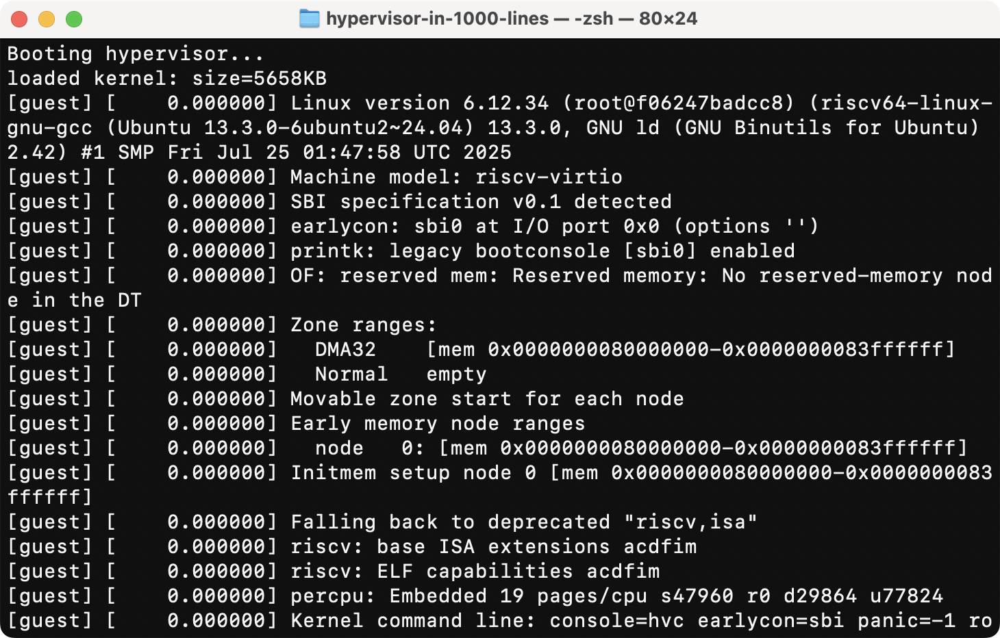

<div class="text-center">
  <h1 class="my-4 font-bold"> Writing a hypervisor<br> from scratch</h1>
  <br><span class="text-4xl">(super quick walkthrough!)</span>
</div>

---

# Target

- Rust programming language (`no_std` mode)
- 64-bit RISC-V with "H"ypervisor extension
- QEMU
  - `qemu-system-riscv64 -machine virt -cpu rv64,h=true`

<br>

- **Note:** Details are omitted for brevity. I'll focus on the overview.

---

# Boot to Rust

```rs
pub extern "C" fn boot() -> ! {
    unsafe {
        asm!(
            "la sp, __stack_top", // Stack address (from linker script)
            "j {main}",           // Jump to main.
            main = sym main,
            options(noreturn)
        );
    }
}

fn main() -> ! {
    loop {} // Infinite loop.
}
```

---

# Putchar via SBI

- Call the firmware's serial driver like BIOS in x86.

```rs
fn sbi_putchar(ch: u8) {
    unsafe {
        asm!(
            "ecall",
            in("a6") 0, // SBI function ID
            in("a7") 1, // SBI extension ID (Console Putchar)
            inout("a0") ch as usize => _, // Argument #0
            out("a1") _ // Argument #1 (not used)
        );
    }
}
```

---

# `println!` macro (Rust's `printf`)

<style>
code {
  font-size: 1.4em;
}
</style>

```rs
pub struct Printer;

impl core::fmt::Write for Printer {
    fn write_str(&mut self, s: &str) -> core::fmt::Result {
        for byte in s.bytes() {
            sbi_putchar(byte);
        }
        Ok(())
    }
}

macro_rules! println {
    ($($arg:tt)*) => {{
        use core::fmt::Write;
        let _ = writeln!($crate::Printer, $($arg)*);
    }};
}
```

---

# Dynamic memory allocator ("bump" algorithm)

<style>
code {
  font-size: 1.34em;
}
</style>

- Unlocks vector (`Vec`), `String`, `LinkedList`, `HashMap`, and more.

```rs
#[global_allocator]
pub static GLOBAL_ALLOCATOR: BumpAllocator = BumpAllocator { ... };

pub BumpAllocator {
    next: usize,
    end: usize,
}

unsafe impl GlobalAlloc for BumpAllocator {
    unsafe fn alloc(&self, layout: Layout) -> *mut u8 {
        let start = self.next;
        self.next += align_up(start, layout.align());
        assert!(self.next <= self.end, "out of memory");
        start as *mut u8
    }
}
```

---
layout: two-cols-header
---

# Guest memory

::left::

```rs
/// Guest-physical address.
struct GuestAddr(usize);

/// A contiguous region.
struct Region {
    start: GuestAddr,
    end: GuestAddr,
    ptr: *mut u8,
}

/// Guest RAM regions.
pub struct GuestMemory {
    regions: Vec<Region>,
    page_table: GuestPageTable,
}
```

::right::


---

# Guest page table

- Maps guest-physical addresses to host-physical addresses.
- Very similar to typical multi-level page tables (like x86-64/Arm).


---

# Load the guest kernel image

```rs
static LINUX_BIN: &[u8] = include_bytes!("linux.bin");
static GUEST_MEMORY: GuestMemory = GuestMemory::new();

// Verify the Linux image format...
assert!(is_valid_riscv_image(LINUX_BIN));

// Allocate memory region and map it to the guest page table.
let buf: &mut [u8]
    = GUEST_MEMORY.allocate(GUEST_BASE_ADDR, GUEST_MEMORY_SIZE);

// Copy the kernel image into the allocated region.
buf.copy_from_slice(LINUX_BIN);
```

---

# Enter the guest mode

- Prepare per-vCPU state, and switch to the guest mode.

<style>
code {
  font-size: 1.2em;
}
</style>

```rs
static mut VCPU: VCpu; // hstatus, pc, sp, a0, a1, ...

impl VCpu {
    pub fn enter_guest() {
        unsafe {
            asm!(
                "csrw hstatus, {hstatus}",
                "csrw sepc, {sepc}",
                "csrw hgatp, {hgatp}",
                /* ... omitted: restore general-purpose registers from `VCPU` ... */
                "sret", // IRET in x86-64
                hstatus = in(reg) VCPU.hstatus,       // CPU flags
                sepc = in(reg) GUEST_BASE_ADDR,       // Guest entrypoint
                hgatp = in(reg) GUEST_MEMORY.hgatp(), // Guest page table
            );
        }
    }
}
```
---

# Handle VM exits (1/2)

<style>
code {
  font-size: 1.5em;
}
</style>

```rs
extern "C" fn trap_handler() -> ! {
    unsafe {
        asm!(
            /* omitted: save registers into VCPU */
            "j {handle_trap}",
            handle_trap = sym handle_trap,
            options(noreturn)
        );
    }
}

fn main() -> ! {
    asm!("csrw stvec, {trap_handler}", trap_handler = sym trap_handler);
}
```
---

# Handle VM exits (2/2)

<style>
code {
  font-size: 1.65em;
}
</style>

```rs
// macro: Read a CSR
macro_rules! read_csr { ... }

// Trap reasons
enum Scause {
    EnvCallFromVSMode,   // "ecall" from VS mode (guest kernel)
    StoreGuestPageFault, // Page fault in the guest mode
}

/// Trap handler.
fn handle_trap() -> ! {
    todo!("handle VM exit here!");
    // Resume the guest mode after handling the exit.
    VCPU.enter_guest();
}
```

---

# VM Exit (1/2): Hypervisor calls

- Similar to system calls, but calls hypervisor functions (SBI in RISC-V).

```rs
match read_csr!(scause) {
    Scause::EnvCallFromVSMode => {
        let eid = VCPU.a7; // SBI extension ID
        if eid == 1 {
            // Console Putchar (EID=1)
            let ch = VCPU.a0 as u8 as char;
            print!("{}", ch);
        } else {
            panic!("unsupported SBI extension: {}", eid);
        }
        VCPU.pc += 4; // Skip the ecall instruction.
    }
}
```

---

# VM Exit (2/2): Memory-mapped I/O

<style>
code {
  font-size: 1.5em;
}
</style>

```rs
match read_csr!(scause) {
    Scause::StoreGuestPageFault => {
        let (inst_len, rs, guest_addr) = todo!("read other CSRs here");
        let value = match rs { // Read the register value
            1 => VCPU.ra,
            2 => VCPU.sp,
            ...
        };
        if is_virtio_blk_range(guest_addr) { // Is it in a MMIO region?
            handle_virtio_blk_mmio(guest_addr, value); // Handle MMIO if so
        } else {
            panic!("unexpected write: {:#x}", guest_addr);
        }
        VCPU.pc += inst_len; // Skip the load/store instruction.
    }
}
```

---

# More on web!

- Visit **https://1000hv.seiya.me** for more details

