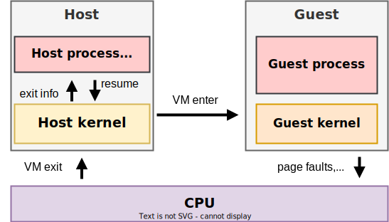
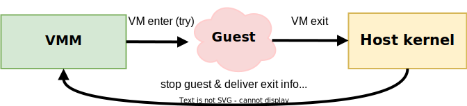
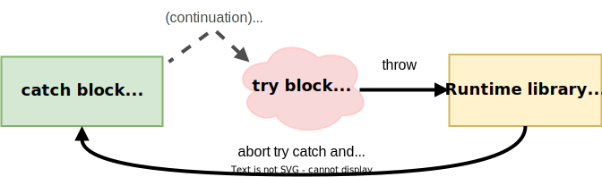
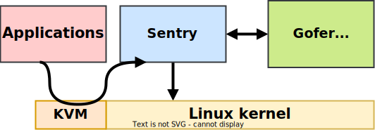
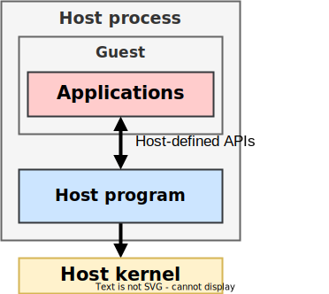
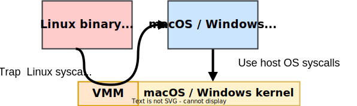
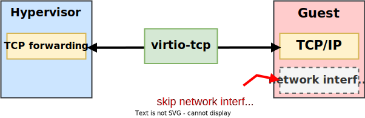
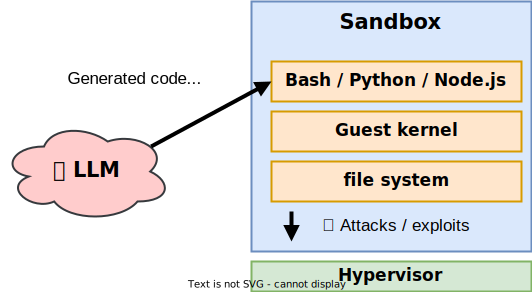

<div style="font-size: 2em !important">
Writing a Hypervisor from Scratch
</div>

<div class="mt-10">
Seiya Nuta

<nuta@seiya.me>
</div>

---
layout: center
---

# What I'm going to talk about

- ❌ Writing a hypervisor from scratch in 40 minutes

- ❌ Being able to write a hypervisor from scratch

- ✅ (hardware-assisted) virtualization are not only for VMs!

---
layout: two-cols-header
---

# Hardware-assisted virtualization

- Intel VT, AMD SVM, Arm VHE, RISC-V H extension...



---
layout: center
---

<div class="text-center">
Intel VT/AMD SVM/Arm VHE/RISC-V H are ...

  <v-click>
  <h1 class="my-4 font-bold"> hardware-assisted try-catch <br><span class="text-2xl">(with continuation)</span> </h1>
  </v-click>
</div>

---

# Try-catch pattern

```ts
try {
    emoji = readFile("emoji.txt");
} catch (error) {
    panic(`failed to read a file: ${error}`);
}
```

- The program keeps running until it encounters an exception.
  - i.e. `catch` is called only when the program needs a help.
- You can't resume the program from the point of failure.
  - Retry from the beginning or abort the program.

---

# Try-catch pattern + continuation

- Let's assume that we have a `resume` callback:

```ts
try {
    emoji = readFile("emoji.txt");
} catch (error, resume) {
    if (error instanceof FileNotFoundError) {
        resume("🍎");
    }

    panic(`failed to read a file: ${error}`);
}
```

- cf. Algebraic Effects

---
src: ./pages/hypervisor-in-1000-lines.md
---

---

# A life of a hypervisor (in JavaScript)

```ts
kernelImage = readFileSync("kernel.bin");

memory = new GuestMemory();  // 1. Prepare memory
memory.copy(kernelImage);    // 2. Load the program (guest kernel)

vcpu = new VCpu();           // 3. Initialize vCPU state
for (;;) {
    try {
        vcpu.enterGuest();   // 4. Enter the guest mode
    } catch (exit) {
        handleVMExit(exit);  // 5. Handle exit and go back to 4
    }
}
```

- Key point: The guest keeps running until it needs an assistance!

---

# Hypervisors are the `catch` block (mostly)

- VMM and try-catch blocks have a similar flow:



<hr>



---

# Hypervisors are the `catch` block (mostly)

<style>
thead th {
  font-weight: 600;
}
</style>

| JavaScript | Hardware-assisted virtualization |
| --- | --- |
| `try` block | guest mode |
| `catch` block | hypervisor's trap handler |
| `throw` | VM exit |
| `error` | VM exit reason |

---
layout: cover
---

# Real-world virtualization APIs

---

# Linux KVM API (simplified)


<style>
code {
  font-size: 1.4em;
}
</style>

- FreeBSD bhyve uses a similar interface (`ioctl`).

```c
guest_memory = mmap(...);                   // 1. Prepare memory
memcpy(guest_memory, ...);                  // 2. Load the program

kvm_fd = open("/dev/kvm", O_RDWR);          
vm_fd = ioctl(kvm_fd, KVM_CREATE_VM, 0);    
vcpu_fd = ioctl(vm_fd, KVM_CREATE_VCPU, 0); // 3. Initialize vCPU state

struct kvm_run *run = mmap(...);
for (;;) {
    ioctl(vcpu_fd, KVM_RUN, &run);          // 4. Enter the guest mode
    switch (run.exit_reason) {              // 5. Handle exit and
        case KVM_EXIT_MMIO:                 //      go back to (4)
        ...
    }
}
```
---

# Fuchsia API (simplified)

- Similar to Linux KVM API.

<style>
code {
  font-size: 1.3em;
}
</style>

```c
zx_guest_create(..., &guest, &vmar);
zx_vmar_allocate(..., &addr);        // 1. Prepare memory
memcpy(addr, ...);                   // 2. Load the program
zx_vmar_map(vmar,...);

zx_vcpu_create(guest, ..., &vcpu);   // 3. Initialize vCPU
zx_vcpu_write_state(vcpu, ...);

zx_port_packet_t packet;
for (;;) {
    zx_vcpu_enter(vcpu, &packet);    // 4. Enter guest mode
    switch (packet.type) {           // 5. Handle exit and
        case ZX_PKT_TYPE_GUEST_MEM:  //       go back to (4)
        ...
    }
}
```

---

# seL4 libvmm API (simplified)

- It's in a callback style, but is the same flow.

<style>
code {
  font-size: 1.6em;
}
</style>

```c
void init(void) {
  linux_setup_images(...); // 1-2. Prepare memory and load the program
  guest_start();           // 3-4. Initialize vCPU and start it
}

// 5. Handle exit and go back to guest mode
seL4_Bool fault(size_t vcpu_id, microkit_msginfo msginfo, ...) {
  label = microkit_msginfo_get_label(msginfo);
  switch (label) {
  case seL4_Fault_VMFault:
      ...
  }
}
```

---

# Hypervisors are `catch` blocks (w/ continuation)

- All APIs have a similar structure:
  1. **Init:** Prepare guest memory and vCPUs
  2. **Try:** Enter the guest mode
  3. **Catch:** Handle an exception (e.g. emulate MMIO)
  4. **Continue:** Jump to step 2

- Hardware-assisted virtualization is not about emulating hardwares.
- It is a generic mechanism to build a different "world" (guest mode).
- That is, it can be applied to more areas, not only virtual machines!
---
layout: cover
---

# The `try-catch` pattern in action

---

# gVisor<sup>1</sup>: Hypervisor as a container sandbox

- A VMM for running multi-tenant Linux containers.
- A new guest kernel written in Go emulates Linux.
- Guest ↔︎ host interface is narrower than running containers directly.



<div class="text-center text-gray-700 text-lg">
<sup>1</sup> https://github.com/google/gvisor
</div>

---
layout: two-cols-header
---

# Hyperlight<sup>2</sup>: Hypervisor as a function sandbox

:: left ::

- VMM for multi-tenant functions.
  - vs. "containers" in gVisor.
- Hardware-assisted virtualization as an isolation boundary.
- Application-specific hypercalls.

:: right ::



<div class="text-center text-gray-700 text-lg">
<sup>2</sup> https://github.com/hyperlight-dev/hyperlight
</div>

----

# Noah<sup>3</sup>: Hypervisor for system call emulation

- Linux binary compatibility using a hypervisor.
- Linux binaries run in the guest mode without a guest kernel.
- Hypervisor as a system call hook: "catch" the system calls.



<div class="text-center text-gray-700 text-lg">
<sup>3</sup> Takaya Saeki, et al. "A robust and flexible operating system compatibility architecture" https://doi.org/10.1145/3381052.3381327
</div>

---
layout: two-cols-header
---

# Nabla Containers<sup>4</sup>: Higher-level hypervisor interface

:: left ::

- Unikernels as (strongly-isolated) processes.
- Q: Do we really need virtual "devices" in guest?
- Hypercalls look more like system calls, not devices.


<div class="text-center text-gray-700 text-lg mt-10">
<sup>4</sup> Dan Williams, et al. "Unikernels as Processes" https://doi.org/10.1145/3267809.3267845
</div>

:: right ::

<style>
thead th {
  font-weight: 600;
  font-size: 0.8em;
}

tbody tr td {
  padding: 2px;
  font-size: 0.8em;
}
</style>

| Hypercalls | System calls |
| --- | --- |
| `walltime` | `clock_gettime` |
| `puts`  | `write(stdout)` |
| `poll` | `ppoll` |
| `blkread` | `pread64` |
| `blkwrite` | `pwrite64` |
| `netwrite` | `write` |
| `netread` | `read` |
| `halt` | `exit_group` |
| `blkinfo` (deprecated) | |
| `netinfo` (deprecated) | |


---

# (hardware-assisted) hypervisors look like interpreters

- Both run a **program in a different world**.
- Both define **an interface** (hypercalls / foreign function interface).
- Both (sometimes) need **a secure isolation** to run untrusted code.


---

# That is ... virtualization is not only for VMs!

- It's a hardware-assited `try-catch` mechanism.
- The guest ↔︎ host interface matters.
  - Application-specific interfaces are OK.
  - Virtio is a great generic queue, but we don't need to stick to it.

<div class="text-center mt-10 font-bold">
gVisor/Hyperlight/Noah are great examples
<br>beyond virtual machines!
</div>

---
layout: cover
---

<div class="text-center">
What's coming next?
<h1 class="my-4 font-bold">The guest ↔︎ host interface goes higher!</h1>
</div>

---

# Virtio alternatives: Do we need a queue interface?

- Virtio is a generic queue + notification mechanism.
- Similar to io_uring - and Linux provides more I/O APIs!


---

# Higher-level interfaces in Virtio: virtio-tcp & udp

- File system is abstracted as virtio-fs.
- What about network?
- What if hypervisor provides TCP/UDP sockets as a virtio device?
- **Challenge:** How to integrate with existing TCP/IP stacks?
- Related work: libkrun's *"Transparent Socket Impersonation"*



---

# Strongly-isolated JavaScript

- Why JavaScript?
  - **Modern web frameworks are creeping into the backend world**
  - Aka. Backend for Frontend (BFF) architecture.
- **V8 isolates are popular isolation in multi-tenant JavaScript clouds.**
  - E.g. Cloudflare Workers and Deno Deploy
  - However, V8 isolates are not a secure isolation boundary.
- What if we use **a thin hypervisor as a secure boundary**, deeply integrated with JavaScript JIT engine?

---

# AI agent sandboxing: LLM↔︎guest interface design

- AI agents need a sandbox (or "workspace") to do their work.
  - We can't trust what LLMs do (e.g. it might do `rm -rf /`).
  - This means everybody would need (more) hypervisors!
- How should LLMs control the sandboxed environment?



---
layout: two-cols-header
---

# Invest in user experience (or *"developer"* experience)

- Example: Hypervisor as a library<sup>5</sup> - use a VM like a subprocess.
- No novel tech here: just change how your hypervisor look like!
- Make people fall in love with your products by a nice API.

<style>
code {
  font-size: 1.2em;
}
</style>

<div class="text-xl mt-4">
❌ Exposing implementation details:
</div>

```
qemu-system-x86_64 -kernel guest.bin -hda cowsay.img -serial stdio ...
```

<div class="text-xl mt-4">
✅ Provide a higher-level interface:
</div>

```rs
use starina_linux::{Command, Stdin};

let cmd = Command::new("/bin/cowsay")
    .stdin(Stdin::from("Hello, world!"))
    .spawn()
```

<div class="text-center text-gray-700 text-lg mt-4">
<sup>5</sup> https://seiya.me/blog/hypervisor-as-a-library
</div>

---
layout: cover
---

# Conclusion

---

# Conclusion

- Hardware-assisted virtualization is not only for VMs.
- Hypervisors are climbing to higher and higher abstraction levels:
  1. Emulating real hardware devices (e1000 ethernet card)
  2. Emulating virtual hardware devices (Virtio)
  3. Higher-level interfaces (system calls)
  4. Even higher-level interfaces (application-specific hypercalls)
- What's next?
