## Writing a Hypervisor From Scratch

Seiya Nuta

<nuta@seiya.me>

---
layout: center
---

# What I'm going to talk about

- ❌ Writing a hypervisor from scratch in 40 minutes

- ❌ Being able to write a hypervisor from scratch

- ✅ (hardware-assisted) virtualization are not only for VMs!

---
layout: two-cols-header
---

# Hardware-assisted virtualization

- Intel VT, AMD SVM, Arm VHE, RISC-V H extension...


---
layout: center
---

Intel VT/AMD SVM/Arm VHE/RISC-V H are ...

# hardware-assisted `try-catch` (with continuation)

---

# Try-catch pattern

```ts
try {
    emoji = readFile("emoji.txt");
} catch (error) {
    panic(`failed to read a file: ${error}`);
}
```

- The program keeps running until it encounters an exception.
  - i.e. `catch` is called only when the program needs a help.
- You can't resume the program from the point of failure.
  - Retry from the beginning or abort the program.

---

# Try-catch pattern + continuation

- Let's assume that we have a `resume` callback:

```ts
try {
    emoji = readFile("emoji.txt");
} catch (error, resume) {
    if (error instanceof FileNotFoundError) {
        resume("🍎");
    }

    panic(`failed to read a file: ${error}`);
}
```

- cf. Algebraic Effects

---
src: ./pages/hypervisor-in-1000-lines.md
---

---

# A life of a hypervisor (in JavaScript)

```ts
kernelImage = readFileSync("kernel.bin");

memory = new GuestMemory();  // 1. Prepare memory
memory.copy(kernelImage);    // 2. Load the program (guest kernel)

vcpu = new VCpu();           // 3. Initialize vCPU state
for (;;) {
    try {
        vcpu.enterGuest();   // 4. Enter the guest mode
    } catch (exit) {
        handleVMExit(exit);  // 5. Handle exit and go back to 4
    }
}
```

---

# Hypervisors are the `catch` block (mostly)

- VMM and try-catch blocks have a similar flow:


<hr>


---

# Hypervisors are the `catch` block (mostly)

| JavaScript | Hardware-assisted virtualization |
| --- | --- |
| `try` block | guest mode |
| `catch` block | hypervisor's trap handler |
| `throw` | VM exit |
| `error` | VM exit reason |

---

# Linux KVM API (simplified)

```c
guest_memory = mmap(...);                   // 1. Prepare memory
memcpy(guest_memory, ...);                  // 2. Load the program

kvm_fd = open("/dev/kvm", O_RDWR);          
vm_fd = ioctl(kvm_fd, KVM_CREATE_VM, 0);    
vcpu_fd = ioctl(vm_fd, KVM_CREATE_VCPU, 0); // 3. Initialize vCPU state

struct kvm_run *run = mmap(...);
for (;;) {
    ioctl(vcpu_fd, KVM_RUN, &run);          // 4. Enter the guest mode
    switch (run.exit_reason) {              // 5. Handle exit and
        case KVM_EXIT_MMIO:                 //      go back to (4)
        ...
    }
}
```
- FreeBSD bhyve uses a similar interface (`ioctl`).

---

# Fuchsia API (simplified)

```c
zx_guest_create(..., &guest, &vmar);
zx_vmar_allocate(..., &addr);        // 1. Prepare memory
memcpy(addr, ...);                   // 2. Load the program
zx_vmar_map(vmar,...);

zx_vcpu_create(guest, ..., &vcpu);   // 3. Initialize vCPU
zx_vcpu_write_state(vcpu, ...);

zx_port_packet_t packet;
for (;;) {
    zx_vcpu_enter(vcpu, &packet);    // 4. Enter guest mode
    switch (packet.type) {           // 5. Handle exit and
        case ZX_PKT_TYPE_GUEST_MEM:  //       go back to (4)
        ...
    }
}
```

---

# seL4 libvmm API (simplified)

```c
void init(void) {
  // 1-2. Prepare memory and load the program
  linux_setup_images(...);
  // 3-4. Initialize vCPU and start it
  guest_start();
}

// 5. Handle exit and go back to guest mode
seL4_Bool fault(size_t vcpu_id, microkit_msginfo msginfo, ...) {
  label = microkit_msginfo_get_label(msginfo);
  switch (label) {
  case seL4_Fault_VMFault:
      ...
  }
}
```

---

# Hypervisors are `catch` blocks (w/ continuation)

- All APIs have a similar structure:
  1. **Init:** Prepare guest memory and vCPUs
  2. **Try:** Enter the guest mode
  3. **Catch:** Handle an exception (e.g. emulate MMIO)
  4. **Continue:** Jump to step 2

- Virtual Machine Monitor (VMM) in userspace (e.g. Firecracker) is a convenient/secure form of implementing the catch block.

---
layout: cover
---

# The `try-catch` pattern in action

---

# gVisor: Hypervisor as a container sandbox

- A VMM for running multi-tenant Linux containers.
- A new guest kernel written in Go emulates Linux.
- Guest ↔︎ host interface is narrower than running containers directly.


gVisor: https://github.com/google/gvisor

---

# Hyperlight: Hypervisor as a function sandbox

- A VMM for running multi-tenant functions (vs. containers in gVisor).
- Uses hardware-assisted virtualization as an isolation boundary.
- Fast cold start time (1-2 ms).
- `Out32` to trigger VM exit.


Hyperlight: https://github.com/hyperlight-dev/hyperlight

----

# Noah: Hypervisor for system call emulation

- Run applications in guest mode **w/o guest kernel**.
- VMM intercepts system calls and emulates them.
- Hypervisor as a system call hook.

https://doi.org/10.1145/3381052.3381327

---
layout: two-cols-header
---

# Nabla Containers: Higher-level hypervisor interface

:: left ::

- Unikernels as (strongly-isolated) processes.
- Q: Do we really need virtual "devices" in guest?
- Hypercalls look more like system calls, not devices.

:: right ::

| Hypercalls | System calls |
| --- | --- |
| `walltime` | `clock_gettime` |
| `puts`  | `write(stdout)` |
| `poll` | `ppoll` |
| `blkread` | `pread64` |
| `blkwrite` | `pwrite64` |
| `netwrite` | `write` |
| `netread` | `read` |
| `halt` | `exit_group` |
| `blkinfo` (deprecated) | |
| `netinfo` (deprecated) | |

<!-- Unikernels as Processes: https://doi.org/10.1145/3267809.3267845 -->

---

# (hardware-assisted) hypervisors look like interpreters

- Both run a program in a different world.
- Both define an interface (hypercalls / foreign function interface).
- Both (sometimes) need a secure isolation to run untrusted code.

TODO: diagram

---

# That is ... virtualization is not only for VMs!

- It's a hardware-assited `try-catch` mechanism.
- The guest ↔︎ host interface matters.
  - Application-specific interfaces are OK.
  - Virtio is a great generic queue, but we don't need to stick to it.

From this perspective, don't Hyperlight, gVisor, Noah sound familar to you?

---
layout: cover
---

What's coming next?

# The guest ↔︎ host interface goes higher!

---

# Virtio alternatives: Do we need a queue interface?

- Virtio is a generic queue + notification mechanism.
- Similar to io_uring - and Linux provides more I/O APIs!


---

# Higher-level interfaces in Virtio: virtio-tcp & udp

- File system is abstracted as virtio-fs.
- What about network?
- What if hypervisor provides TCP/UDP sockets as a virtio device?
- **Challenge:** How to integrate with existing TCP/IP stacks?
- Related work: libkrun's *"Transparent Socket Impersonation"*

---

# Strongly-isolated JavaScript

- Why JavaScript?
  - **Modern web frameworks are creeping into the backend world**
  - Aka. Backend for Frontend (BFF) architecture.
- **V8 isolates are popular isolation in multi-tenant JavaScript clouds.**
  - E.g. Cloudflare Workers and Deno Deploy
  - However, V8 isolates are not a secure isolation boundary.
- What if we use **a thin hypervisor as a secure boundary**, deeply integrated with JavaScript JIT engine?

---

# AI agent sandboxing: LLM↔︎guest interface design

- We can't trust what LLMs do (e.g. it might do `rm -rf /`).
- Hot topic in industry: especially for coding agents.
- How should LLMs control the sandboxed environment?


<!-- ---

# Efficient VM snapshotting

- Cold start time is a key performance metric in multi-tenant hypervisors.
- VMM and Linux kernel are pretty fast (< 20ms) to boot up.
- Applications are super slow to start up (> 100ms), and VM snapshots solve this.
- However, VM snapshot images are not so small (> 100MB).
- How should we manage VM snapshots efficiently?
  - Stargz Snapshotter (lazy pulling). -->

---

# Invest in user (*"developer"*) experience

- **Hypervisor as a library:** use a VM like a subprocess.
- **Strongly-isolated CGI:** spawn lightweight VM per HTTP request, like we use to do in `cgi-bin`.

**No novel technology here: just change how your hypervisor look like!**
